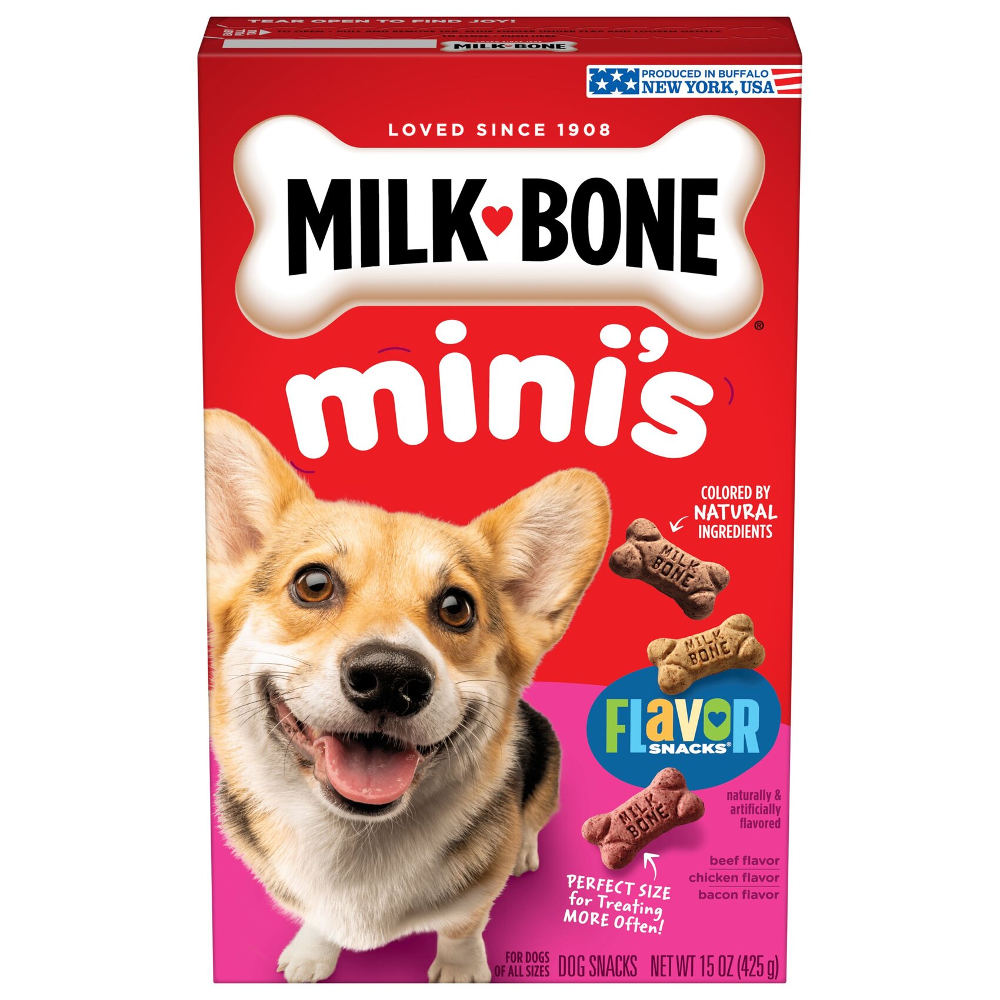
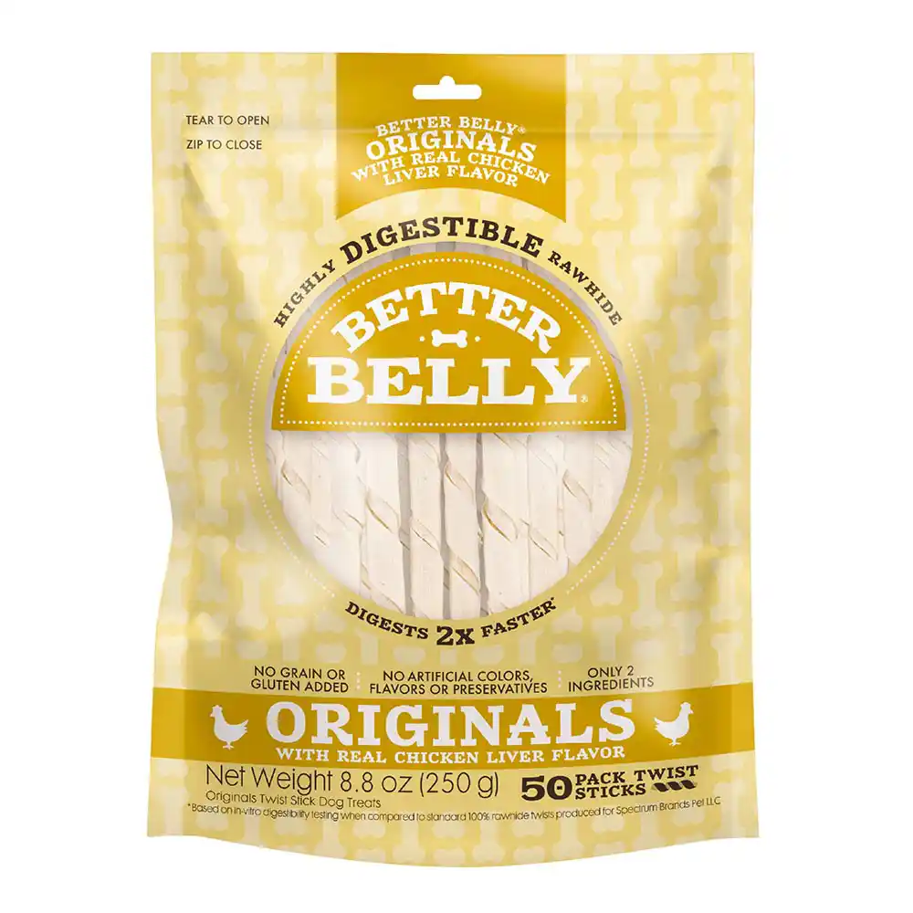

# Treats & Chews

## Treats

Finn loves treats and often gets one after coming in from a walk or being outside. His favorites include mini-milk bones and small soft training treats.

## Chews

Finn enjoys a daily rawhide chew. It's great enrichment for him since he will sprint around the house with it before chewing it.
He can also substitute a rawhide with a pig ear.

